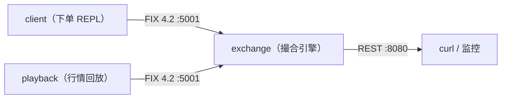

<div align="center">

# rust-trader

**模拟电子交易所** — 价格-时间优先撮合 · 手写最小 FIX 4.2 会话层 · 只读 REST 行情

[](https://github.com/kmind-git/rust-trader/actions/workflows/release.yml)
[](./rust-toolchain.toml)
[](./DEPLOY.md)

</div>

---



## ✨ 特性

| | |
|---|---|
| 🔁 **撮合引擎** | 价格-时间优先（BTreeMap 价格档、档内 FIFO）、限价/市价单、做市商报价、撤单（F）/改单（G）、市价剩余撤销、DAY 到期与断线自动撤单，全程 Decimal 精确运算 |
| 📠 **FIX 4.2 会话层** | 手写最小实现（不引 FIX 引擎依赖）：Logon/Logout、心跳与 TestRequest 探测、序号维护与重发恢复、预定义会话表准入；quickfixgo 风格 message/event 双文件会话日志（行时间北京时间，报文时间 UTC） |
| 📡 **REST 行情** | 只读四端点（品种/盘口/统计/会话），arc-swap 无锁快照读 |
| 🧰 **工具链** | `client` 下单 REPL、`playback` 行情回放模拟市场、`exchange --server` 前台服务模式（配合 systemd） |
| ⚙️ **工程化** | 固定工具链 + GitHub Actions 产出 musl 静态候选包（ELF 静态门禁、SHA-256 可追溯）；单元/集成测试与独立 FIX 4.2 线协议验证脚本 |

## 🚀 快速开始

```bash
git clone https://github.com/kmind-git/rust-trader.git
cd rust-trader
cargo build --release
```

三个终端：

```bash
# 终端 1：交易所（REST :8080 + FIX acceptor :5001）
./target/release/exchange

# 终端 2：回放模拟市场
./target/release/playback -fix configs/qf_connector_settings -id PLAYBACK -file configs/playback.txt

# 终端 3：下单 REPL
./target/release/client -fix configs/qf_connector_settings -id CLIENT
```

<details>
<summary><b>client REPL 命令</b></summary>

```text
buy AAPL 3          # 市价买单
buy AAPL 5 100.5    # 限价买单
sell IBM 2 101.0    # 限价卖单
modify 1 100.0 5    # 改单（新价格 新数量）
cancel 1            # 撤单
quit                # 注销退出
```
</details>

交易所交互控制台（不带 `--server` 运行时）：`help` / `sessions` / `book SYMBOL` / `list` / `quit`。

REST 查询（无鉴权，只读）：

```bash
curl http://localhost:8080/api/instruments/
curl http://localhost:8080/api/book/AAPL
curl http://localhost:8080/api/stats/AAPL
curl http://localhost:8080/api/sessions
```

## 📡 REST API

| 方法 | 路径 | 说明 |
|---|---|---|
| GET | `/api/instruments/` | 已加载的品种列表 |
| GET | `/api/book/{SYMBOL}` | 盘口（档位价格/数量，带递增 sequence） |
| GET | `/api/stats/{SYMBOL}` | 成交量、最高/最低价、买卖盘聚合 |
| GET | `/api/sessions` | 当前接入的 FIX 会话 |

## 📠 FIX 4.2 会话

- **预定义会话表准入**：`configs/qf_exchange_settings` 的每个 `[SESSION]` 用 `TargetCompID` 声明允许的客户端，未声明者在 Logon 即拒（[ADR-0006](docs/adr/0006-declared-session-admission.md)）；`DynamicSessions=Y` 是项目扩展，可恢复任意接入。
- **QuickFIX 风格配置**：`[DEFAULT]`/`[SESSION]` 结构，DEFAULT 继承、SESSION 覆盖；未知键、非法布尔/端口、非 `FIX.4.2` 的 BeginString 均在启动时报错。`qf_connector_settings` 同时声明 `CLIENT` 和 `PLAYBACK` 两个 initiator，两个工具用 `-id` 选择会话。
- **内存态会话**：必须显式 `PersistMessages=N`、`ResetOnDisconnect=Y`、`ResetOnLogout=Y`、`UseDataDictionary=Y`；超出当前实现范围的 QuickFIX 默认值（如 `PersistMessages=Y`）会明确报错而不是被静默忽略。
- 协议范围与逐消息审计见 [docs/fix42-audit.md](docs/fix42-audit.md)。

<details>
<summary><b>最小 acceptor 配置</b></summary>

```ini
[DEFAULT]
ConnectionType=acceptor
BeginString=FIX.4.2
HeartBtInt=30
ResetOnLogout=Y
ResetOnDisconnect=Y
PersistMessages=N
UseDataDictionary=Y
Logging=Y

[SESSION]
SenderCompID=GOX
TargetCompID=CLIENT
SocketAcceptPort=5001
```

同一监听端口可继续添加 `[SESSION]` 声明其它客户端。initiator SESSION 还须提供 `SenderCompID`、`TargetCompID`、`SocketConnectHost` 和 `SocketConnectPort`；缺少必要字段或出现多个匹配会话都会在启动时失败。
</details>

线协议独立验证：

```bash
cargo build --bins
python tests/fix42_wire.py    # 字典来源与测试边界见 tests/README.md
```

## 📦 构建与部署

| 目标 | 方式 |
|---|---|
| **Windows** | `cargo build --release`，产物在 `target/release/{exchange,client,playback}.exe` |
| **Linux（x86_64）** | GitHub Actions [release.yml](.github/workflows/release.yml) 产出 **musl 静态**候选包：三个二进制零 glibc 依赖，RHEL / CentOS 7 起可直跑，包内含 systemd unit、SHA256SUMS 与构建元数据 |
| **内网离线** | `cargo vendor` 离线源码包，纯离线编译（见 [DEPLOY.md](DEPLOY.md) 内网章节） |

部署手册（systemd、防火墙、离线构建）：**[DEPLOY.md](DEPLOY.md)**
打包与验收方案：[docs/linux-rhel76-packaging-plan.md](docs/linux-rhel76-packaging-plan.md)

## 🧱 模块结构

```text
src/
├── core/            # 领域核心（纯逻辑，无 IO）
│   ├── instrument.rs  # 品种表
│   ├── order.rs       # 订单/状态机
│   ├── orderbook.rs   # 价格档 + 撮合循环
│   ├── exchange/mod.rs# 引擎（会话、订单入口、缓存更新）
│   └── stats.rs       # 统计聚合
├── fix/             # 手写最小 FIX 4.2 会话层（ADR-0001）
│   ├── frame.rs       # tag=value 帧、BodyLength/CheckSum
│   ├── codec.rs       # 业务消息编解码（D/F/G/i ↔ 8/b/j/d）
│   ├── session.rs     # acceptor + initiator
│   ├── log.rs         # quickfixgo 风格 message/event 会话日志（ADR-0005）
│   └── config.rs      # quickfix 风格配置解析
├── market_data.rs   # arc-swap 行情快照（无锁读）
├── queue.rs         # 有界出站队列
├── rest.rs          # 只读 REST（tiny_http，ADR-0002）
└── bin/             # exchange / client / playback
```

## 📚 文档

| 文档 | 内容 |
|---|---|
| [docs/adr/](docs/adr/) | 架构决策记录（下表） |
| [docs/rust-trader-architecture.html](docs/rust-trader-architecture.html) | 交互式架构图（明暗主题 / 视图导览 / 导出） |
| [docs/fix42-audit.md](docs/fix42-audit.md) | FIX 4.2 协议范围与逐消息审计 |
| [docs/fix-delivery.md](docs/fix-delivery.md) | FIX 回报直达 writer 的队列与满载语义 |
| [docs/performance.md](docs/performance.md) | 性能与并发模型 |
| [docs/linux-rhel76-packaging-plan.md](docs/linux-rhel76-packaging-plan.md) | musl 打包与 RHEL 7.6 验收方案 |
| [tests/README.md](tests/README.md) | 测试与线协议验证说明 |
| [CONTEXT.md](CONTEXT.md) | 术语表 |

| ADR | 决策 |
|---|---|
| [0001](docs/adr/0001-handwritten-minimal-fix-session.md) | 手写最小 FIX 会话层，不引 FIX 引擎依赖 |
| [0002](docs/adr/0002-synchronous-threading-model.md) | 同步线程模型，不引 async 运行时 |
| [0003](docs/adr/0003-contract-shrink.md) | 契约基线收缩：移除零使用的表面功能 |
| [0004](docs/adr/0004-fix42-wire-protocol.md) | FIX 4.2 线协议基线 |
| [0005](docs/adr/0005-fix-session-logs.md) | QuickFIX/Go 风格 message/event 会话日志 |
| [0006](docs/adr/0006-declared-session-admission.md) | 预定义会话表准入，拒绝未声明客户端 |

## 🔧 排错

<details>
<summary><b>常见问题</b></summary>

- **FIX 会话日志在哪**：acceptor 写 `logs/exchange/{BeginString-Sender-Target}.messages|event.current.log`；client 写 `logs/client/`、playback 写 `logs/playback/`。messages 记每条收发报文原文（`in`/`out` 方向前缀，含心跳），帧损坏时保留 `in-hex` 的无损十六进制；event 记会话事件（登录/注销/序列号/超时，措辞对齐 QuickFIX/Go）。`Logging=Y/N`（默认 Y）与 `FileLogPath` 可覆盖，见 [ADR-0005](docs/adr/0005-fix-session-logs.md)。日志行时间使用 UTC+8，FIX 报文字段时间仍按 UTC。
- **Windows 构建报 exe 被占用 / 运行报 os error 10048**：残留的 exchange/client/playback 进程锁住了 target 下的 exe 或 8080/5001 端口，先结束残留进程再构建/运行。
</details>

## 许可

[GPL-2.0](LICENSE)
