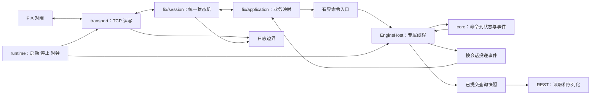

# rust-trader 架构重构方案

状态：提案，尚未实施。日期：2026-09-15。

建议采用“单进程、模块化单体、确定性核心、独立 FIX 状态机”的架构。先隔离职责，再将引擎状态收敛到专属线程；保留同步网络和当前盘口结构。专属线程用于统一状态所有权和生命周期，不预先承诺提高吞吐，性能关卡未通过时保留较早阶段的调用方式。

## 1. 目标与不变约束

本轮重构目标是降低协议与撮合之间的耦合，让会话故障、队列超限、时间推进和服务退出具有统一且可测试的处理路径，并为性能测量建立明确边界。

必须保留：

- 现有消息范围内正确使用 FIX 4.2；未支持的消息、字段选项和配置明确拒绝。依据 [FIX 审计范围](fix42-audit.md)，不退回早期 Go/FIX 4.4 行为。
- DEFAULT 继承、SESSION 覆盖及当前实际支持的 QuickFIX 配置语义。项目扩展继续明确标注；不能靠同名配置宣称未实现的功能。
- 当前订单、改单、撤单、报价、DAY 到期、断连撤单、字符串 ClOrdID 和回报关联语义；价格优先、同价 FIFO、Decimal 运算。
- REST 端点、字段、数值表示、404 行为，以及现有 sequence 的含义和递增规则。跨多个 HTTP 请求不承诺同一事务快照。
- exchange/client/playback 三个程序、默认交互行为、`--server` 及当前部署入口。
- 已有 BTreeMap 价格档、档内索引、增量聚合、有界非阻塞队列和 REST 锁外序列化，详见 [性能报告](performance.md)。

本次不包含新增 FIX 消息、持久化/历史重放、分布式撮合、跨品种并行、订单类型扩展，也不引入 async 运行时。日志轮转与持久化审计策略作为独立能力评审。先保持单 crate，模块稳定后才考虑拆 Cargo workspace。

## 2. 当前架构及问题证据

| 当前位置 | 已确认的实现 | 结构性影响 |
|---|---|---|
| [fix/session.rs](../src/fix/session.rs) | reader/writer、序号恢复、握手、心跳、业务处理、拒绝编码、WireIdMap、initiator 视图集中在一个文件 | 单个改动容易跨协议、业务和线程生命周期；acceptor/initiator 行为难以复用验证 |
| [core/exchange/mod.rs](../src/core/exchange/mod.rs) | Engine 同时管理订单簿、会话、Sender、报告、缓存、统计和日期；入口直接加载品种文件、读取 Utc 时间 | 核心并非完全不含外部副作用；相同命令流难以独立重放 |
| [core/orderbook.rs](../src/core/orderbook.rs) | 已完成结构优化，成交内部仍直接取 SystemTime | 容器无需重写，时间来源应从外部传入 |
| [queue.rs](../src/queue.rs) | 容量 1024、try_send、共享 AtomicBool 失败标记 | 同一个布尔值无法解释故障原因；按条数限额，缺少字节预算和队列可观测性 |
| [rest.rs](../src/rest.rs) | 已锁外序列化，但快照克隆仍通过共享 Engine 的 Mutex | 查询仍参与交易状态的锁竞争，深度较大时复制成本留在临界区 |
| [fix/log.rs](../src/fix/log.rs) | 文件日志在调用线程中同步写入 | 磁盘抖动影响读写线程；异步化前必须先明确溢出、错误和 flush 语义 |
| [bin/exchange.rs](../src/bin/exchange.rs) | 程序入口承担配置组合、服务启动和控制台；后台模式已可用 | 服务组件停止、线程 join 和错误传播尚无统一管理边界 |

额外优先处理的工作量来源：每个连接循环都调用 DAY 过期扫描；断连遍历订单时会重复重建同一品种快照。前者应统一时钟驱动，后者先保留可见 sequence 行为，再评估是否可合并内部计算。

现有 [重写方案](rust-rewrite-plan.md) 和早期 ADR 包含已被 FIX 4.2 修复取代的 Go 对照说明，作为历史记录保留，实施时增加“已取代”的引用，不直接抹去历史。

## 3. 目标模块与依赖



图为目标架构。第一阶段仍可使用共享锁调用纯核心，通过迁移验证后再切换 EngineHost。

建议目录：

```text
src/
  core/
    command.rs         # New/Replace/Cancel/Quote/OpenSession/CloseSession/ExpireDay
    event.rs           # 领域回报、交易、状态变化；无 FIX tag
    ids.rs             # SessionKey、OrderId、RequestId、EventId 等类型
    engine.rs          # 应用命令，维护订单/会话状态，返回效果
    order.rs / orderbook.rs / instrument.rs / stats.rs
  application/
    engine_host.rs     # 状态所有权、命令调度、时钟命令
    session_registry.rs # 会话代次、准入、关闭通知、事件目标
    delivery.rs        # 非阻塞报告投递及失败处理
    read_model.rs      # 已提交快照与读取句柄
  fix/
    frame.rs           # 字节分帧与检查
    codec/
      admin.rs / orders.rs / quotes.rs / rejects.rs / profile.rs
    session/
      machine.rs       # 纯状态转移；acceptor/initiator 共用
      sequence.rs / timers.rs / effects.rs
      acceptor.rs / initiator.rs
    application.rs     # FIX 消息和领域命令/事件转换、ClOrdID 映射
    config.rs          # 兼容已有路径的导出入口
  transport/
    tcp.rs             # socket、读写、写完成通知、关闭
    bounded.rs         # 容量/字节预算、错误原因、统计
  config/
    parser.rs / resolve.rs / validate.rs / runtime.rs
  observability/
    session_log.rs / metrics.rs
  rest/
    routes.rs / dto.rs  # 依赖 ReadHandle，不依赖可变 Engine
  runtime/
    supervisor.rs / shutdown.rs / clock.rs
  bin/                 # 参数解析后装配组件
```

按职责逐步创建，不一次性生成全部空模块。`core` 不引用 FIX、socket、文件、channel 或全局系统时钟；application/runtime 可以依赖 core，反方向禁止。普通内部调用优先具体类型，仅对时钟、投递、查询等有实际替换需求的边界定义小接口，避免每个结构体配一层 trait。

## 4. 核心契约与状态所有权

### 4.1 命令和领域事件

接口示意，不是可直接编译的承诺：

```rust
struct CommandEnvelope {
    session: SessionKey,       // FIX 会话身份 + connection generation
    request: RequestId,        // 内部关联；外部 ClOrdID 留在 FIX adapter
    command: EngineCommand,
}

fn apply(&mut self, command: CommandEnvelope, context: &CommandContext)
    -> Result<EngineEffects, EngineError>;

struct EngineEffects {
    events: Vec<DomainEvent>,
    changed_instruments: Vec<InstrumentId>,
}
```

`CommandContext` 显式传入业务 UTC 时间和可重放的 ID 上下文。单调时间用于连接超时，由 runtime 提供；UTC 用于 FIX 时间和 DAY 边界，不能混为一个计时器。引擎事件的序列和标识生成规则必须与现有回报契约对齐；跨进程唯一性需求另行定义。

一条命令在确定次序下完成业务校验、撮合、订单记录、统计和事件生成；状态提交后才能投递。网络发送失败不撤销已经成交的交易。一个接收方满载也不能阻止向其它成交方投递事件。大单一次产生的事件向量须度量峰值内存；后续可复用缓冲区，不能通过截断事件减少分配。

品种文件由启动层加载成领域数据后传入核心。DAY 到期由 EngineHost 统一生成命令；时钟未跨日时不重复扫描所有订单，跨日后按既定顺序到期。保持原 UTC 日界语义，注入虚拟时钟做测试。

### 4.2 EngineHost 与有界调度

目标是一个线程拥有 Engine，多个连接通过有界入口提交命令。它只执行命令、发布快照、非阻塞投递事件，不做 socket 或磁盘 IO。相比每个 reader 争用 Engine Mutex，顺序和关闭流程更明确；新增排队、上下文切换可能增加低负载延迟，必须测量。

- 同一连接 FIFO；不同连接以 EngineHost 实际接收顺序为准，不新增对网络到达先后的保证。
- 入口同时限制命令数量和估算字节；每会话有额度，防止一个连接占满全局队列。容量在基准后确定，初始复用当前 1024 只作为测试起点。
- 未进入队列的请求不会执行。拥塞时如果可以在协议上正确拒绝且出站仍可用，发送关联拒绝；否则关闭会话并记录原因，不能发送格式不适用的泛化拒绝。
- Close/Stop 不与交易请求竞争同一可满载的队列。使用按已登记会话数量受限的关闭标志表及唤醒机制，或预留控制通道；它必须在交易队列满载时仍可触达。
- 每个调度批次先检查关闭标志，批次大小有上限；标记关闭后跳过该代次尚未执行的请求，清理其订单。已经提交的成交保持有效。
- 先保留单引擎。按品种分片会改变跨品种 sequence、会话清理与管理行为，仅在测得单线程瓶颈后另立方案。

### 4.3 会话代次与关闭幂等性

引入 `SessionKey = logical identity + generation`。登记成功才允许提交应用命令；重复在线身份仍拒绝。延迟到达的旧连接清理、队列失败和报告只能作用于对应 generation。

状态建议为 `Opening → Active → Closing → Closed`。关闭请求幂等；进入 Closing 后不再执行该代次新业务，释放在线身份须等 EngineHost 确认订单清理完成。新连接不能复用旧连接的队列或 ID 映射。控制表需有最大连接数和握手数限额，关闭路径也要有预算。

## 5. FIX 边界和状态机

采用共用的 `SessionMachine::on_event(event, clock) -> effects`。事件包含收到报文、计时器、发送完成/失败、业务回报、主动关闭；效果包含请求发送、发出应用命令、定时器变更、关闭连接。状态机只处理协议状态，不调用 Engine。

第一步仅提取现有 SequenceState 和校验器，保持 writer 拥有发送序号。第二步迁移时由唯一的会话协调器管理输入/输出序号，writer 只发送已经编码的字节并反馈结果；每个阶段都必须只有一个序号所有者，不能在拆文件过程中新增第二处递增。

具体边界：

- `frame` 负责原始字节、BodyLength、CheckSum 和资源上限，不负责订单合法性。
- `codec/profile` 负责已支持消息的字段/组/枚举校验，不访问业务状态。
- `session` 负责 CompID、Logon/Logout、序号、GapFill、重复消息和心跳；业务拒绝映射不散落在线程循环。
- `fix/application` 负责字段到领域命令、DomainEvent 到 FIX 回报，维护字符串 ClOrdID 与内部 ID 的映射及请求关联。
- `initiator` 的 OrderView/FillView 与用户回调作为独立客户端适配器。慢回调不在状态机锁内执行；回调队列有界，过载显式失败，不无界排队。
- acceptor 与 initiator 的差异通过角色状态/策略表达，不能简单合并分支而丢失各自握手义务。

保留当前 FIX42.xml 独立 TCP 校验。新增状态转移测试和消息分片、乱序、GapFill 重叠、重复请求、错误心跳关联、注销超时的生成式输入测试。对“合法但不在 profile”的请求，核对拒绝类型、引用字段和后续会话状态。

## 6. 查询、配置、日志与运行管理

### 查询快照

EngineHost 提交后发布每个品种的 `Arc<InstrumentSnapshot>`，其中 Book、Stats 和版本来自同一次提交。ReadHandle 经短时间只读锁克隆 Arc，然后离锁序列化；不让 REST 持有 Engine 或复制整本深度到锁外。初期采用标准库 RwLock，无需立即引入额外并发依赖。

只重建受影响品种的快照，不克隆整所 map。保留已有 sequence 递增规则；合并断连计算可以减少重建次数，但不能未经批准压缩可见 sequence。发布不能采用无界增量事件消费者，否则会重新引入积压。每个快照有内部提交版本与发布时间，便于测量陈旧度；不改变现有 REST JSON 字段。

### 配置

固定流水线：原文解析 → DEFAULT/SESSION 解析及来源记录 → 继承解析 → 支持范围与跨会话一致性校验 → 不可变 RuntimeConfig。程序只读取强类型结果，不在各个 bin 再次决定默认值。保留可审计的有效配置输出，敏感值脱敏；新资源限制使用明确项目命名空间，不占用含义不同的 QuickFIX 键。旧扩展保留兼容解析。

### 日志与指标

先抽象日志入口并测量耗时，初期保持同步写入以控制行为变化。只有指标证明需要时才引入有界日志写线程；届时需明确：原始报文顺序、in/out 与 in-hex、UTC+8 展示、文件命名、写失败、队列满和退出 flush 行为。不能静默丢失 FIX message 日志，也不能宣称磁盘同步持久化。

增加本地可查询的计数/直方图接口：每会话队列条数和字节数、高水位、溢出原因、命令排队时间、撮合处理时间、快照发布耗时、REST 读取/序列化耗时、socket 写耗时与断连原因。第一阶段不新增外部监控服务依赖。

### 生命周期

Supervisor 统一拥有 listener、会话句柄、EngineHost、REST 和日志组件。停止顺序：停止新连接/新业务 → 按会话发起有期限 Logout → 停止剩余 transport → 完成对应代次的清理 → flush 日志并 join。交易拥塞不能阻断停止信号；超期明确记录强制关闭结果。

`--server` 仍为前台服务进程，不自行 daemonize。Linux SIGTERM、Windows 控制事件与交互 quit 汇入同一停止入口；实际信号适配依赖在实施阶段验证，不能仅靠 Windows 测试宣称 systemd 平台验证完成。

## 7. 迁移分期与提交边界

每阶段独立可编译、可测试，不将机械迁移与状态机重写放进同一个大提交。

| 阶段 | 改动范围 | 可交付成果 | 退出条件 |
|---|---|---|---|
| R0 建立基线 | tests、examples、文档 | 冻结 FIX/REST 契约；记录当前行为、负载和资源数据 | 所有现有回归通过，测量可重复 |
| R1 拆分协议模块 | fix/session、codec、配置入口 | 按职责移动代码，旧导出路径保留 facade | 报文/REST 行为无变化，只有模块依赖变化 |
| R2 纯化核心 | core、application/delivery、clock | 核心返回事件；去除 channel、IO 和直接取时钟；仍可用 Mutex 调用 | 相同命令和时钟输入产生相同事件与状态；故障投递不破坏已提交成交 |
| R3 统一状态机及生命周期 | fix/session/machine、runtime、session_registry | 共享状态转移、唯一序号所有者、代次隔离、统一关闭 | 故障矩阵与双角色测试通过；关闭不依赖数据队列空闲 |
| R4 专属引擎与读模型 | engine_host、read_model、REST | 有界命令入口、独立控制路径、Arc 快照查询 | 正确性通过；排队/延迟/内存关卡通过，否则保留 R2/R3 模式 |
| R5 加固与文档收口 | 配置、指标、部署、ADR | 限额、故障原因、平台停止测试、运维说明 | 压测可复现，无阻塞退出和持续积压；ADR 与实际实现一致 |

R1 优先收益是降低修改面，R2/R3 是本次重构主体，R4 是有性能关卡的并发调整。日志异步化、按品种分片和多 crate 拆分不作为 R5 的强制交付。

替换策略：先在测试中保留旧实现作为差分参照，再通过应用装配切换，禁止同时向两套引擎发送真实订单。每阶段完成后可回退对应提交；运行中的内存订单不能跨二进制版本自动迁移，部署切换需停接单、协调存量订单和会话后重启。不能把 Git 回退称为在线状态回滚。

粗估 R0–R5 合计 12–20 个有效工作日，假设一名熟悉项目的开发者及可用的 Linux 测试环境；只是拆分工作量的初估，R0 后依据状态机测试缺口重新估算，不是交付日期承诺。

## 8. 验收矩阵和性能关卡

| 类别 | 必须验证 |
|---|---|
| 协议 | 现有 FIX42 独立 TCP 测试；各支持消息成功/失败；拒绝引用；序号唯一所有权；合法恢复与错误输入后的状态 |
| 撮合 | 价格时间优先、部分成交改单、累计均价、双侧报价、重复 ID、DAY 边界、空盘口统计；增量值与逐单参考值一致 |
| 会话生命周期 | 重复在线 CompID、旧代次延迟关闭、业务队列满载时断连、在途请求与关闭竞态、对端不回应 Logout、慢 initiator 回调 |
| 投递 | 一个成交方满载时另一方仍收到已提交成交；不给未执行请求发送成功；溢出不静默继续交易 |
| 查询 | JSON/404 兼容；单次品种快照的 book/stats 同版本；连续写入下不会无限占用内存；查询不进入 Engine 临界区 |
| 配置/日志 | 继承、覆盖、默认值、非法设置；原始日志字节及扩展；限额/日志失败状态可见 |
| 部署 | stdin EOF、交互 quit、服务终止、线程回收、打包路径；Windows 与 Linux 分别记录结果 |

性能工作负载至少包括：低并发轻负载、深价格档、宽价格档、持续交叉成交、撤改单密集、报价替换、多个 REST 读者、一个慢 FIX 接收方与正常接收方同时运行。连接数/品种数/订单数用阶梯测试寻找拐点，不推测真实生产容量。

测量 p50/p95/p99（区分排队、核心计算、端到端），有效请求吞吐、CPU、RSS 峰值和稳态、队列高水位、断连检测和清理时间。release 构建、相同机器、同一输入种子，预热并重复至少 5 次；新旧交替运行以减小环境偏差。现有 book_bench 单次数据只作参考，不能作为 R4 放行依据。

建议初始性能关卡：正常负载 p99/吞吐不得出现超过 5% 的稳定回退；小于 5% 的差异须结合波动区间，不做过度解释。慢客户端影响应局限于自身资源预算，正常客户端不因等待其网络而停顿。具体资源上限、断连时限和目标吞吐在 R0 实测后固化；未建立基线时不填写虚构 SLO。

## 9. 主要风险与设计约束

| 风险 | 处理方式 |
|---|---|
| 专属线程引入额外排队延迟 | R4 独立测量及回退关卡，不与模块拆分绑定交付 |
| 事件化后出现状态已提交但回报未送达 | 明确状态提交与网络交付不是同一事务；保留成交，关闭失败会话并记录原因 |
| 控制队列也满载，断连/停止无效 | 控制通知与数据入口分离，按会话有界保存，优先处理并验证满载场景 |
| 顺序重构导致相同请求回报次序变化 | 冻结命令效果顺序和 wire trace；单点拥有序号 |
| Arc 读模型保留过多旧快照 | 无历史列表；限制并发请求和响应生命周期，测量活跃快照峰值 |
| 新配置改变既有继承或默认值 | 强类型配置仅在解析后生成，兼容测试逐项对照 |
| 老接口 facade 长期存在导致两套逻辑 | facade 只转发，阶段验收后去除旧路径，禁止复制实现 |

## 10. 批准实施时的建议范围

建议先实施 R0–R3，交付模块拆分、确定性核心、共享 FIX 状态机和统一会话生命周期；在测量基础上决定 R4 是否替换引擎调用模型。R5 中的配置/指标/部署验证随前述阶段推进。

本文件仅为架构方案。本次没有修改 Rust 实现、运行配置或现有架构图；文档检查不等于方案已经完成实现与性能验收。
